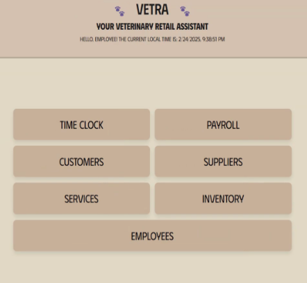

# Vetra - Veterinary Retail Assistant 🐾

## Description
**Vetra** is a **full-stack interactive application** designed to streamline pet store operations. It provides **inventory management, payroll tracking, customer and supplier management, billing, and reporting tools** in an intuitive and user-friendly interface.

---

## 🚀 Features
- **Inventory Management** 📦: Track products, update stock, and manage reorder points.
- **Time Clock & Payroll** ⏳💰: Employees can clock in/out, and payroll is auto-calculated.
- **Customer & Supplier Management** 🛒: Store customer data, manage suppliers, and optimize orders.
- **Billing System** 💳: Process transactions and track sales.
- **Reports & Analytics** 📊: Generate insights on store performance.
- **Authentication** 🔑: Secure login with JWT-based authentication.
- **Responsive & Interactive UI** 🎨: Built using React for seamless user experience.

---

## 🛠️ Technologies Used
| **Tech Stack**     | **Purpose** |
|-------------------|------------|
| **React.js** | Frontend framework |
| **Node.js & Express.js** | Backend API |
| **PostgreSQL & Sequelize** | Database & ORM |
| **JWT Authentication** | User authentication |
| **Render** | Deployment |
| **Bootstrap & Custom CSS** | UI Styling |

---

## 📸 Screenshots

_Example of the Vetra Home Dashboard_

---

## 🌐 Deployment
- **Live Application:** [https://pms-retail.onrender.com/](#)
- **GitHub Repository:** [https://github.com/melinanev/PMS_retail](#)

---

## 🔄 Installation & Setup
### **1️⃣ Clone the Repository**
```sh
git clone https://github.com/your-repo/vetra.git
cd vetra
